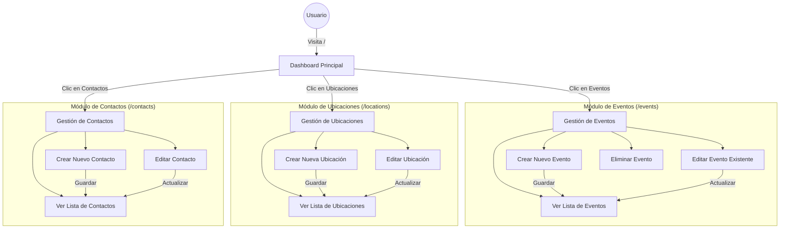

# Informe Técnico: Sistema de Gestión de Eventos

**Fecha:** 26 de Diciembre, 2025
**Proyecto:** Event Management System / Stitch Event Creation

## 1. Diseño de Navegación (Wireflow)

El siguiente diagrama ilustra el flujo de navegación de la aplicación. El usuario aterriza en el **Dashboard** principal, desde donde puede navegar a las secciones de gestión de **Eventos**, **Ubicaciones** y **Contactos**. Cada una de estas secciones permite visualizar, crear, editar y eliminar registros (CRUD).

## 2. Diseño de Pantallas y Funcionalidades

### 2.1 Dashboard Principal (`/dashboard`)
**Funcionalidad:**
-   Punto de entrada principal.
-   Muestra métricas clave (ej. total de eventos, ubicaciones).
-   Acceso rápido a las secciones principales mediante tarjetas de navegación.

### 2.2 Gestión de Eventos (`/events`)
**Funcionalidad:**
-   **Listado:** Muestra todos los eventos registrados con detalles como nombre, fecha y ubicación.
-   **Creación:** Formulario (generalmente en modal o nueva página) para agregar nombre del evento, fecha, imagen y asignar una ubicación.
-   **Edición/Eliminación:** Controles para modificar o borrar eventos.
-   **Integración:** Utiliza las ubicaciones registradas.

### 2.3 Gestión de Ubicaciones (`/locations`)
**Funcionalidad:**
-   **Listado:** Visualiza las sedes disponibles.
-   **Gestión:** Permite agregar direcciones, nombres de sedes y capacidades.
-   **Mapa:** (Si implementado) Muestra la ubicación en un mapa (Google Maps).

### 2.4 Gestión de Contactos (`/contacts`)
**Funcionalidad:**
-   **Directorio:** Lista de personas de contacto u organizadores.
-   **Datos:** Almacena nombre, email, teléfono y rol.

## 3. Código Fuente

El código fuente completo está disponible públicamente en el siguiente repositorio:

**Repositorio GitHub:** [https://github.com/Jeidendk/IHM-CP1.git](https://github.com/Jeidendk/IHM-CP1)

*Nota: El repositorio es público y puede ser accedido para validación.*

## 4. Evidencias de Ejecución

La aplicación fue probada localmente con `php artisan serve`. A continuación se muestran capturas de las pantallas principales.

**URL del Proyecto (Local):** `http://127.0.0.1:8000`
**URL del Proyecto (Producción - Vercel):** [INSERTE_URL_VERCEL_AQUI]

### 4.1 Dashboard Principal

### 4.2 Gestión de Eventos

### 4.3 Gestión de Ubicaciones

### 4.4 Gestión de Contactos

